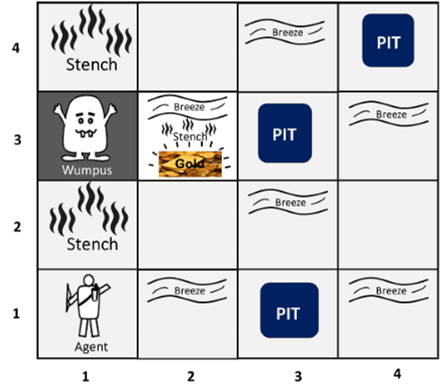

<!DOCTYPE html>
<html lang="pt-BR">
<head>
  <meta charset="UTF-8">
  <meta name="viewport" content="width=device-width, initial-scale=1.0">
</head>
<body>
  <h1>Projeto "O Incrível Mundo de Wumpus"</h1>

  <h2>Descrição</h2>
  
Este projeto consiste na implementação de um programa em JavaScript que simula a solução do jogo "O Incrível Mundo de Wumpus". O jogo envolve um agente que navega por um labirinto (mapa) em busca de ouro, enquanto evita perigos como buracos e o temível Wumpus.

  <h2>Funcionalidades</h2>
  <ul>
    <li><strong>Leitura de Mapa Fixo:</strong> O programa lê um mapa fixo do jogo, onde estão posicionados buracos, o Wumpus, ouro e o agente.</li>
    <li><strong>Inteligência Artificial:</strong> Utiliza um algoritmo de busca ou lógica para determinar os movimentos do agente.</li>
    <li><strong>Objetivo:</strong> O objetivo do agente é coletar o ouro e evitar ser morto pelo Wumpus ou cair em buracos.</li>
  </ul>

  <h2>Tecnologias Utilizadas</h2>
  
JavaScript

  <h2>Exemplo de Mapa</h2>
  <pre>
  </pre>
  
Legenda:

  <ul>
    <li><strong>Agent:</strong> Posição inicial do agente.</li>
    <li><strong>Wumpus:</strong> Posição do Wumpus.</li>
    <li><strong>Pit:</strong> Posição de um buraco.</li>
    <li><strong>Gold:</strong> Posição do ouro.</li>
    <li><strong>Breeze:</strong> Nas posições adjacentes ao buraco, terá brisa.</li>
    <li><strong>Stench:</strong> Nas posições adjacentes ao Wumpus, terá feedor</li>
  </ul>

</body>
</html>
